## **Research Background**

The mitigation policies or lockdown measures imposed by local and national gov-ernments to control the spread of COVID-19 have created drastic changes in people's livelihood, economy, and environment. We investigated the impacts of the COVID-19 crisis on the atmospheric environment by comprehensively understanding the spatio-temporal patterns of air pollutants in California, USA. The investigation results provided knowledge about humans and environmental re-sponses to the pandemic.

**Pre-requisite**

1. Python IDE (Visual Studio Code, Pycharm, or anything of your choice)
2. Python 3.8.12
3. For Windows 64 - Anaconda3-2021.05
4. KNIME

**Data Explanation**
The study was conducted through the comparison among three periods:
1. before (January 26 – March 18)
2. during (March 19 – May 8)
3. after (May 9 – June 14) 

The lockdown of California in 2020 and compared the emission patterns of air pollution with annual means of 2015-2019. California was selected as the study area of this research due to its severe condition of the spread of COVID-19 and high air pollution rates. We col-lected ground-based observations of air pollutants such as NO2, O3, CO, PM2.5, and PM10 obtained from the Environmental Protection Agency (EPA) and satellite NO2 ob-servations acquired from Ozone Monitoring Instrument (OMI) aboard NASA's Earth Observing System's (EOS) Aura satellite.

**Steps**

* Step 1: Create a new folder and name it as per your preference. For example, let's say CA_Air_Pollution

* Step 2: Clone this repository. The CA - Air Pollution has below folders and files:
  
    1. Air Pollutants Data - The folder has California ground-based air pollution data - CO, O3, NO2, PM10, PM2.5, SO2
    2. Air Quality Analytical Tool - The folder has OMI_statitic_ca.py file. The script calculates periodical (pre, peri, and post) means of 2020 and 2015-2019, and their       differences
    3. Air Quality Results - The folder has alifornia_counties_covid_env_data.xlsx file. The files holds daily average concentration for each pollutant. Seven-day moving average and standard error.
    4. requirements.txt - The text files contains the list of python packages required for the script.

Additionally, download the satellite-based NO2 observations data from this [link](https://drive.google.com/drive/folders/1ZieN-_Z8Mv6ILqjLdhD0frNP8Y1BBOmI?usp=sharing)

* Step 3: Open the command prompt/terminal in your system. Navigate to your project folder CA_Air_Pollution
  
  ```
  cd CA-Air Pollution
  ```

* Step 4: Create a new conda environment.

    **For Windows and Mac**

    ```
    conda create -n env-analysis-no2 python=3.8
    ```

    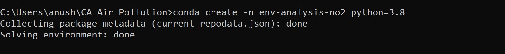

* Step 5: Activate the conda environment.

    **For Windows and Mac**

    ```
    conda activate env-analysis-no2
    ```

    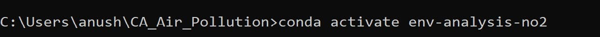


* Step 6: Install packages for the script.

    1. Execute below comment to install required python packages.<br/>

    ```
    pip install -r requirements.txt
    ```

   2. Next, install gdal, fiona, and geopandas. To successfully install these packages, first install GDAL, second install fiona, and last install geopandas.
   
      1. Using this [link](https://www.lfd.uci.edu/~gohlke/pythonlibs/), download GDAL‑3.3.3‑cp38‑cp38‑win_amd64.whl, Fiona‑1.8.20‑cp38‑cp38‑win_amd64.whl, and 
         geopandas-0.10.2-py2.py3-none-any.whl files.
   
   # GDAL WHL screenshot

   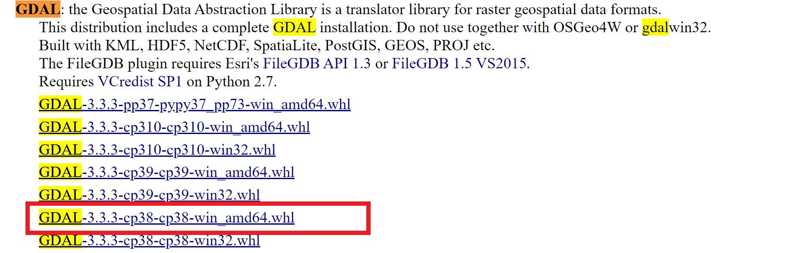 

   # Fiona WHL screenshot
   
   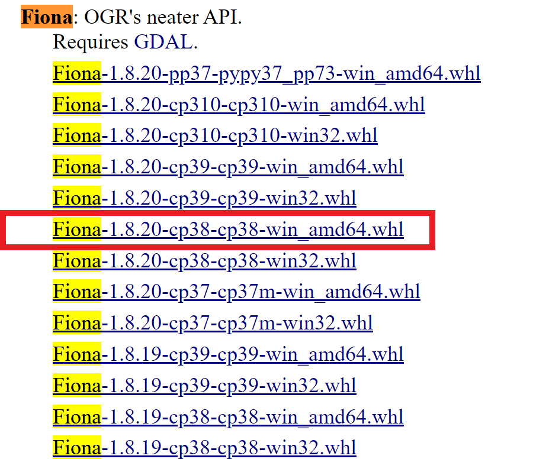

   # Geopandas WHL screenshot

   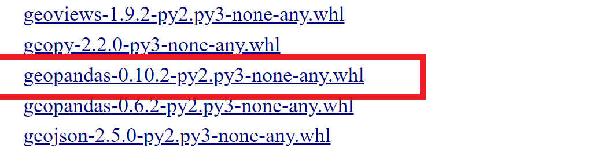


   3. In terminal, install the packages using pip. For example to install GDAL, type
   
    ```
    pip install [path_where_you_download_GDAL_WHL_FILE]
    ```
   
   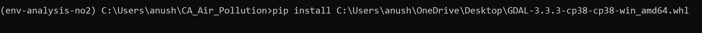

   4. Similarly, install fiona package.
   
   ```
   pip install [path_where_you_download_FIONA_WHL_FILE]
   ```
   
   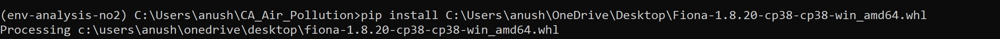


   5. Finally, install geopandas package.

   ```
   pip install [path_where_you_download_GEOPANDAS_WHL_FILE]
   ```
   
   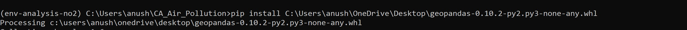

   1. Install matplotlib, basemap, and basemap-data-hires packages using
   
   ```
   conda install matplotlib
   ```

   ```
   conda install -c conda-forge basemap
   ```

   ```
   conda install -c conda-forge basemap-data-hires
   ```

* Step 7: The cript OMI_statitic_ca.py calculates:
    1. periodical (pre, peri, and post) means of 2020 and 2015-2019
    2. anomalies of each period in 2015-2019 and 2020 
    3. differences between periods.
   
   1. First, calculate the means of pre, peri, and post periods in 2015-2019 and 2020. Run the script using below command:
   
    ```
    python OMI_Static_CA.py -t mean
    ```

    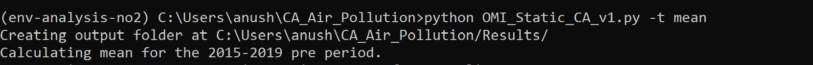


    ## Sample output
    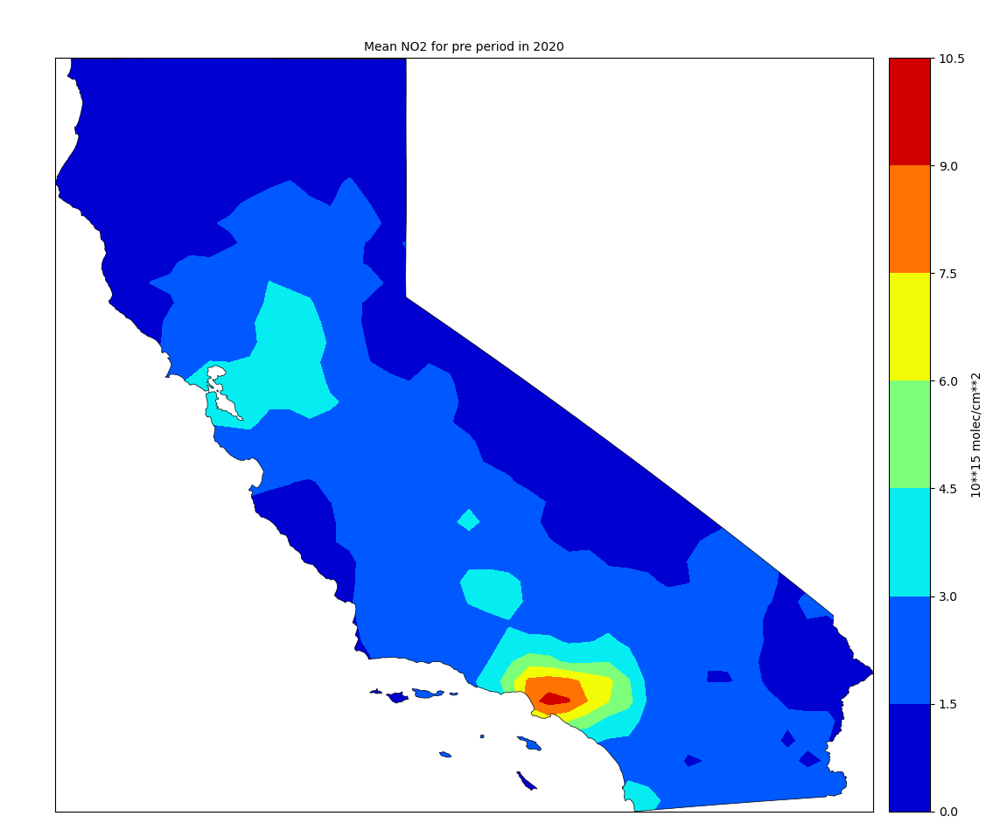

    **Note**: After the script finished running, you can see Results folder inside the project folder. Inside the Results folder you can see the mean values of periods in NC4 file format. Additionally, you can see Images folder inside Results folder. Inside Images folder, you will see PNG files.

    2. Second, calculate the anomalies of mean values of 2015-2019 and 2020 for each period. Run the script three times. On each time specify the three periods: pre, peri, and post. Screenshot below.
   
    ```
    python OMI_Static_CA.py -t anomaly
    ```
   
    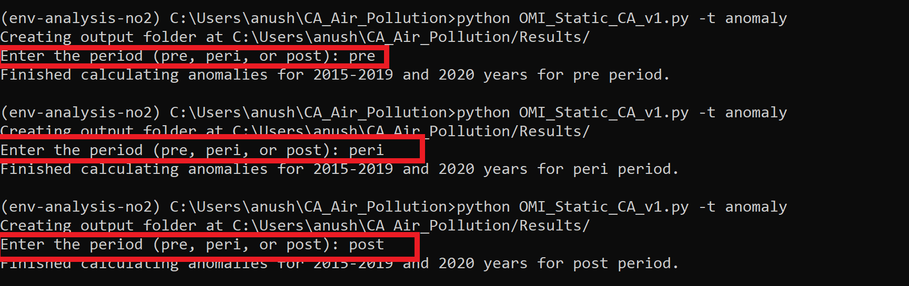

    3. Third, calculate the differences between periods.

    ```
    python OMI_Static_CA.py -t difference
    ```

    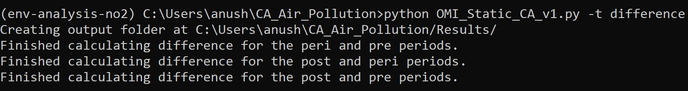


**Useful links**

2. Ground-based observations of air pollutants: https://www.epa.gov/outdoor-air-quality-data/download-daily-data

3. Satellite NO2 observations: [https://disc.gsfc.nasa.gov/datasets/OMNO2d_003/summary](https://disc.gsfc.nasa.gov/datasets/OMNO2d_003/summary)

4. National highways: https://catalog.data.gov/dataset/tiger-line-shapefile-2016-nation-u-s-primary-roads-national-shapefile


**Author**

Qian Liu<br>
Email: qliu6@gmu.edu


**Tutorial Video**

[](https://www.youtube.com/watch?v=hwQF3_ZJSJY)

